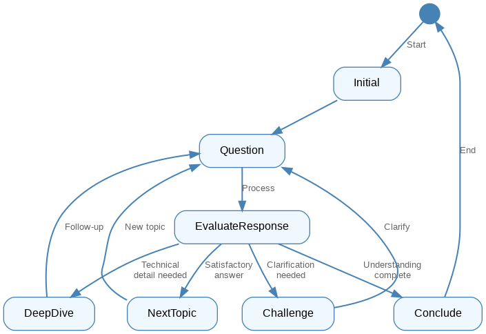

# LLM-as-an-Interviewer
This is the official GitHub repository for [LLM-as-an-Interviewer: Beyond Static Testing Through Dynamic LLM Evaluation](https://arxiv.org/abs/2412.10424).

LLM-as-an-Interviewer is an evaluation framework that assesses the capabilities of LLMs through an interview-style process. In this approach, the LLM acting as the interviewer evaluates other LLMs by providing feedback and asking follow-up questions, enabling a more comprehensive assessment of their capabilities.

Our framework includes a flexible pipeline that can be easily adapted to various tasks by incorporating a customized evaluation rubric.

## 🚀 Quick Start
- Git Clone
- Install requirements
```
"openai>=1.55.2",
"python-dotenv>=1.0.1",
"pyyaml>=6.0.2",
"rich>=13.9.4",
"click"
```

- Setup API key in .env file
```
OPENAI_API_KEY=YOUR_OPENAI_API_KEY
OPENROUTER_API_KEY=YOUR_OPENROUTER_API_KEY
```


- ***Note:*** To test local models, you can use [vLLM serve](https://docs.vllm.ai/en/latest/serving/openai_compatible_server.html?ref=blog.mozilla.ai) to launch the OpenAI compatible server.


- Run the following command to start the interview
```bash
python libs/interview_eval/main.py --config examples/configs/math_problem_solving.yaml
```

## 📦 Installation

```bash
pip install interview-eval
```

## 🌟 Features

- AI-powered interviewer and interviewee agents
- Configurable interview parameters and evaluation rubrics
- Real-time conversation display with rich formatting
- Detailed scoring and feedback system
- Progress tracking and maximum question limits
- Customizable OpenAI client configuration

## Basic Usage

- All you need is the below code snippet and your customized `config.yaml` file!

```python
from interview_eval import InterviewRunner, Interviewer, Interviewee, InterviewReportManager
from interview_eval.utils import console, load_config, setup_logging
import logging
import yaml

# Load configuration
config = load_config("config.yaml")

# Setup logging and console
logger, log_file_path = setup_logging(config_data, verbose)

# Initialize agents
interviewer = Interviewer(config=config_data, name="Interviewer")
interviewee = Interviewee(config=config_data, name="Student")
report_manager = InterviewReportManager(config=config_data)
# Create and run interview
runner = InterviewRunner(interviewer, student, config_data, logger, log_file_path, console, report_manager)
results = runner.run()
```

## ⚙️ Configuration

Create a YAML configuration file with the following structure:

```yaml
interviewer:
  name: "Technical Interviewer"
  model: "model name"
  client:
    api_key: ${OPENAI_API_KEY}
  instructions: "Your interview guidelines..."
  rubric: "Evaluation criteria..."
  strategy:
    policy: [...]
    follow_up_rules: [...]
  seed_question: [...]
  rubric: [...]

interviewee:
  name: "Candidate"
  model: "model name"
  client:
    api_key: ${OPENAI_API_KEY}
  instructions: "Interviewee behavior guidelines..."

session:
  initial_message: "Welcome to the interview..."
  max_questions: 10
  max_retries: 2
  initial_context: {}

logging:
  save_to_file: true
  output_dir: "logs"
  filename_template: "session_{timestamp}.log"

report:
  save_to_file: true
  output_dir: "reports"
  filename_template: "report_{timestamp}.txt"

```

## **Guideline for Customizing the YAML File**

This guide explains how to customize the YAML file based on your needs to create and configure an effective interview session between an interviewer and an interviewee.

---

### **1. Interview Type**
Define the type of interview:
```yaml
interview_type: <type>
```

---

### **2. Interviewer Configuration**
The `interviewer` section customizes the behavior and attributes of the interviewer.

#### **Basic Settings**
```yaml
interviewer:
  name: "<Interviewer Name>"
  model: "<Interviewer AI Model>"
  client:
    api_key: ${<API_KEY_VARIABLE>}
```
- **`name`**: Provide a name for the interviewer (e.g., "Teacher").
- **`model`**: Specify the AI model to use (e.g., `gpt-4o-mini`).
- **`api_key`**: Add the API key environment variable. (e.g., `${OPENAI_API_KEY}`).

#### **Instructions**
Define the behavior and goals of the interviewer:
```yaml
  instructions: |
    <Interviewer instructions here>
```
- Example: "You are a science interviewer assessing high school knowledge. Topics to cover: Biology, Physics."

#### **Hint Strategy**

This is the prompt used when the interviewer provides hints (feedback) to the interviewee. Customize how the interviewer provides hints:
```yaml
  hint_prompt_template: |
    "<Hint strategy description>"
```
If not specified, it will default to the following:
- Default: "Given the following, you have to give a hint to the interviewee to help them answer the question correctly. \nIf the {interviewee_name} makes repeated mistakes, give more hints to fix the mistake.\n"

#### **Questioning Strategy For Follow-Up Questions**
This is the instruction used when the interviewer provides follow-up questions to the interviewee.

Define the approach to questioning:
```yaml
  strategy:
    max_questions: <Number>
    policy:
      - "<Questioning rule 1>"
      - "<Questioning rule 2>"
    follow_up_rules:
      - "<Follow-up rule 1>"
      - "<Follow-up rule 2>"
```
- **`max_questions`**: Set the maximum number of questions allowed.
- **`policy`**: Define the overall questioning flow (e.g., increasing difficulty, no duplicates).
- **`follow_up_rules`**: Specify how to probe deeper or handle incomplete answers.

#### **Seed Question**

Provide the initial question to kickstart the interview:

```yaml
  seed_question: "<First question>"
```

- If you are not using the existing benchmark dataset and prefer to define your own scenario (e.g., a café interview scenario), you can set your custom seed question here.
- If you are using a benchmark dataset, the seed question can be dynamically assigned as follows:

```python
interviewer.seed_question = question['question']
interviewer.seed_question_answer = question['solution']
```

#### **Grading Rubric**
Specify the grading criteria:
```yaml
  rubric: |
    <Grading criteria>
```
- Example: "Score from 0-10 based on problem-solving accuracy and explanation depth."

---

### **3. Interviewee Configuration**
The `interviewee` section defines the simulated student or participant.

#### **Basic Settings**
```yaml
interviewee:
  name: "<Interviewee Name>"
  model: "<Interviewee AI Model>"
  client:
    api_key: ${<API_KEY_VARIABLE>}
```
- **`name`**: Name of the participant (e.g., "Student").
- **`model`**: Specify the AI model (e.g., `openai/gpt-4o-mini-2024-07-18`).

#### **Instructions**
Define the participant’s role, strengths, and challenges:
```yaml
  instructions: |
    <Interviewee instructions here>
```
- Example: "You are a high school student who excels in Geometry but struggles with Algebra."

---

### **4. Session Configuration**
Control session parameters, such as retries and initial messages:
```yaml
session:
  max_questions: <Number>
  max_retries: <Number>
  initial_message: "<Message>"
  initial_context:
    interview_complete: <true/false>
    current_topic: "<Topic>"
    questions_asked: <Number>
    assessment_notes: []
```
- **`max_questions`**: Limit the session length.
- **`max_retries`**: Set how many retries are allowed.
- **`initial_message`**: Customize the opening message.
- **`initial_context`**: Define the starting context, such as the topic and initial notes.

---

### **5. Logging Configuration**
Enable or disable logging and customize log file details:
```yaml
logging:
  save_to_file: <true/false>
  output_dir: "<Directory>"
  filename_template: "<Filename format>"
```
- **`save_to_file`**: Set to `true` to save logs.
- **`output_dir`**: Define the directory for logs.
- **`filename_template`**: Use placeholders like `{timestamp}` for dynamic filenames.

---

### **6. Reporting Configuration**
Control reporting options for the session:
```yaml
report:
  save_to_file: <true/false>
  output_dir: "<Directory>"
  filename_template: "<Filename format>"
```
- Similar to the logging configuration, but for reports.

---

### **Customization Tips**
- **Focus on Roles:** Clearly define interviewer and interviewee roles for clarity in behavior.
- **Adapt Strategies:** Tailor hint and questioning strategies to align with the interview's goals.
- **Contextual Seed Questions:** Use a relevant seed question to set the tone.
- **Test Configuration:** Validate settings in a test environment to ensure smooth performance.
- **Dynamic Variables:** Leverage placeholders (e.g., `${OPENAI_API_KEY}`, `{timestamp}`) for flexibility.


## 🎯 Advanced Interview

### Custom Interview Flows

***Note: This feature is still under development and will be available in future releases.***

`interview-eval` lets you define custom interview flows as directed graphs, where each node represents an interview state (like asking questions or evaluating responses) and edges represent possible transitions between states. With this feature, you can create complex interview scenarios with branching logic, follow-up questions, and adaptive feedback based on the interviewee's responses.

Below is an example flow of interview, where the Interviewer evaluates the Interviewee's response and chooses to do one of the following actions: 
- Ask a follow-up question (Deep Dive)
- Move on to the next topic (Next Topic)
- Ask for clarification (Challenge)
- End the interview (Conclude)




### Question Decontamination

For users conducting benchmark-based interview (like GSM8K, MMLU, etc.), `interview-eval` provides functions to prevent test set contamination through three transformation strategies:

```python
from interview_eval import decontaminate_question

# Choose from three decontamination methods
question = decontaminate_question(
    question="What is 15% of 200?",
    reference_answer="30",
    method="modifying"  # or "unclarifying" or "paraphrasing"
)
```

1. **Unclarifying** (`method="unclarifying"`)
   - Removes key information while maintaining grammar
   - Forces interviewee to ask clarifying questions
   - Evaluates information-gathering skills

2. **Paraphrasing** (`method="paraphrasing"`)
   - Preserves exact meaning with different wording
   - Changes sentence structure
   - Maintains problem complexity

3. **Modifying** (`method="modifying"`)
   - Creates new but related questions
   - Keeps similar domain and difficulty
   - Tests same knowledge areas


Batch processing of questions is also supported:

```python
from interview_eval import batch_decontaminate

questions = [
    {"question": "Q1...", "reference_answer": "A1..."},
    {"question": "Q2...", "reference_answer": "A2..."}
]

decontaminated = batch_decontaminate(
    questions,
    method="modifying",
    model="gpt-4"
)
```
